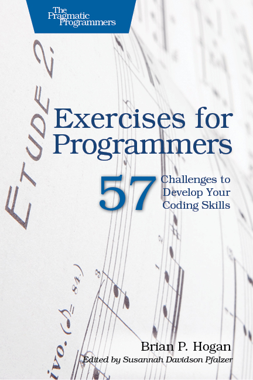

# My solutions to "Exercises for Programmers" by Brian P. Hogan
I used this project as repo for solving the exercises with constraints and challenges presented in this book:

(for more info visit the book's website: https://pragprog.com/titles/bhwb/exercises-for-programmers/).

This project is structured in modules, each of them containing structured packages, corresponding to the different exercises.

I work following clean code and other practices that allows to have an orderly and understandable project, so to, among other advantages, allow flawless collaboration with others.

## Tech Stack
The choice of Tech Stack that I adopted for the solutions is ample, given the diverse requirements (constraints and challenges) of the exercises; it can be summarised as:
- *Base Exercises* (exercises that require no GUI and can be solved in console) &rarr; **Java**
- *GUI Exercises* (exercises that have a challenge asking to implement the same program using a graphical user interface) &rarr; **Java + HTML + Javascript**
- *Mobile version Exercises* (exercises that have a challenge asking to implement a mobile version of the program) &rarr; **Android Studio App with Java Backend**
- *Web Application Exercises* (exercises that have a challenge asking to implement a web application version of the program) &rarr; **Spring Boot (Backend) + Angular (frontend)**

## Other Implementations details
I enjoyed delving into the different requests this book presented, finding creative solutions to the problems at hand. 
I particularly loved to challenge myself with paradigms and technologies there were fairly new to me, as the ones used for creating the Mobile and Command-line Applications.

Additionally, in the case of some full programs (Chapter 10), when the exercises didn't explicitly state that a GUI was required, I took this as an additional challenge and found elegant ways to reach a complete implementation of the application, using mainly the console to gather the user's input.

